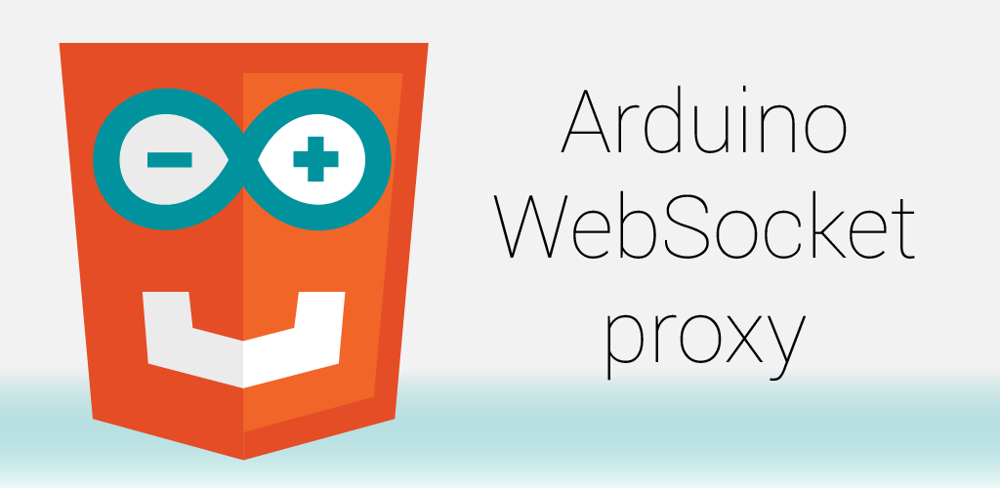

Arduino WebSocket proxy enables an Arduino board and a web page to communicate with each other. The communication between the Arduino board and the app uses ADK (Accessory Development Kit) over USB. The communication between the web page and the app uses WebSocket.

The web page can run on the Android device or on a computer on the same wireless network. There's no security, anyone on the same network can talk to the app.

All communication that goes through the app is logged on screen.

The app works with any accessory. It will be launched automatically if the accessory uses the following information: `manufacturer="Wigwam Labs"`, `model="Arduino WebSocket proxy"`, `version="1.0"`.
